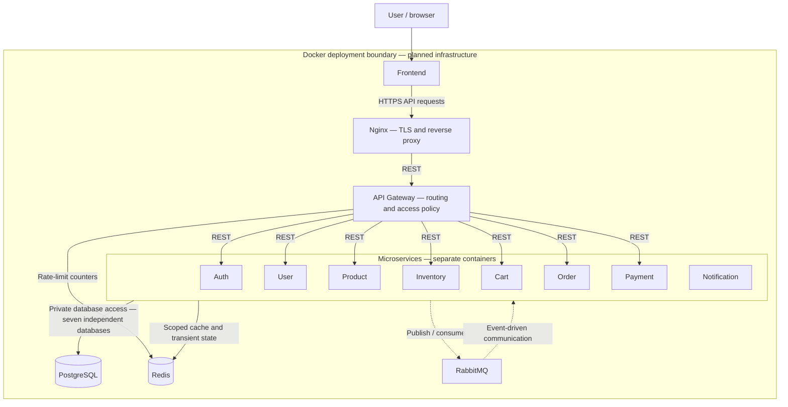

# Architecture microservice

Architecture and folder skeleton for a modular, independently deployable e-commerce platform. This repository contains documentation and empty structural placeholders only; it is not runnable.

The current repository directory represents `NAJMI-E-COMMERCE/` in the logical structure below.

## Folder structure

```text
NAJMI-E-COMMERCE/
├── frontend/
├── api-gateway/
├── services/
│   ├── auth-service/
│   ├── user-service/
│   ├── product-service/
│   ├── inventory-service/
│   ├── cart-service/
│   ├── order-service/
│   ├── payment-service/
│   └── notification-service/
├── infrastructure/
│   ├── nginx/
│   ├── redis/
│   ├── rabbitmq/
│   └── docker/
├── databases/
│   ├── auth-db/
│   ├── user-db/
│   ├── product-db/
│   ├── inventory-db/
│   ├── cart-db/
│   ├── order-db/
│   └── payment-db/
├── docs/
│   └── architecture/
│       └── README.md
├── docker-compose.yml
├── .env.example
└── README.md
```

Every microservice has exactly the same internal architecture:

```text
service/
├── app/
│   ├── Domain/
│   ├── Application/
│   ├── Infrastructure/
│   └── Interfaces/
├── routes/
├── config/
├── database/
├── tests/
├── Dockerfile
└── .env.example
```

Empty directories include `.gitkeep` solely to preserve the structure in version control. Dockerfiles, environment examples, and Compose are intentionally empty. No dependency manifests, runtime configuration, application code, database schemas, or migrations are supplied.

## Architecture diagram

Solid arrows represent HTTPS/REST or explicitly labeled storage access. Dashed arrows represent asynchronous RabbitMQ communication.



The PostgreSQL and Redis arrows above summarize access; exact ownership and allowed users are documented below and in the detailed diagrams. Notification has no database and no public gateway route in this initial design. Nginx also serves or proxies frontend delivery; the displayed request chain follows the browser's API request after loading the frontend.

## Service responsibilities and data ownership

| Component | Responsibility | Exclusive PostgreSQL database |
| --- | --- | --- |
| Auth | Credentials, identity, token issuance, refresh sessions, account access state | `auth-db` |
| User | Customer profiles, addresses, contact preferences | `user-db` |
| Product | Catalog, categories, descriptions, authoritative product prices | `product-db` |
| Inventory | Stock levels, reservations, reservation expiry, stock commitment and release | `inventory-db` |
| Cart | Customer carts and requested quantities; displayed prices are provisional | `cart-db` |
| Order | Checkout coordination, immutable purchase snapshots, totals, order lifecycle | `order-db` |
| Payment | Payment attempts, provider references, payment status, refunds | `payment-db` |
| Notification | Event-triggered email/SMS delivery using external providers | None; durable RabbitMQ queues hold pending work |

Services alone access their own databases. Other services obtain data through REST or events, never shared tables, cross-database joins, or direct database credentials. `databases/` reserves infrastructure documentation locations; each service's `database/` reserves its future persistence artifacts. Both remain empty.

## Supporting components

| Component | Architectural role |
| --- | --- |
| Frontend | Customer-facing presentation boundary; calls the public gateway through Nginx |
| Nginx | Public ingress, TLS termination, frontend delivery/proxying, reverse proxy to the gateway |
| API Gateway | Public REST entry, token verification, request routing, rate limits, correlation identifiers; no business workflow ownership |
| PostgreSQL | Seven logically isolated databases with service-specific credentials and independent lifecycle management |
| Redis | Product cache, inventory availability cache, cart cache, transient authentication controls, gateway rate-limit counters |
| RabbitMQ | Durable asynchronous event distribution with consumer-specific queues, retry handling, and dead-letter queues |
| Docker | Independent containers, private networks, persistent volumes, and deployment boundaries |

See [detailed architecture](docs/architecture/README.md) for REST dependencies, event producers and consumers, database ownership, Redis boundaries, and the proposed deployment layout.
