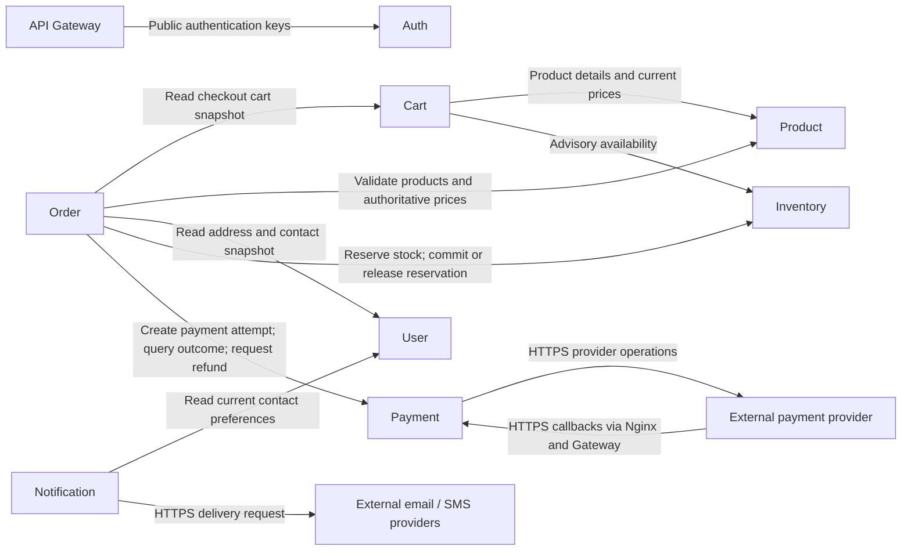
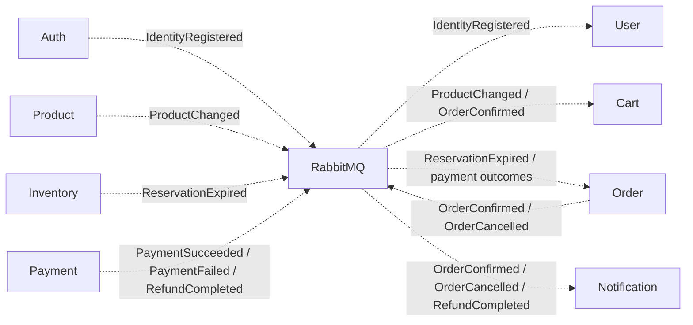
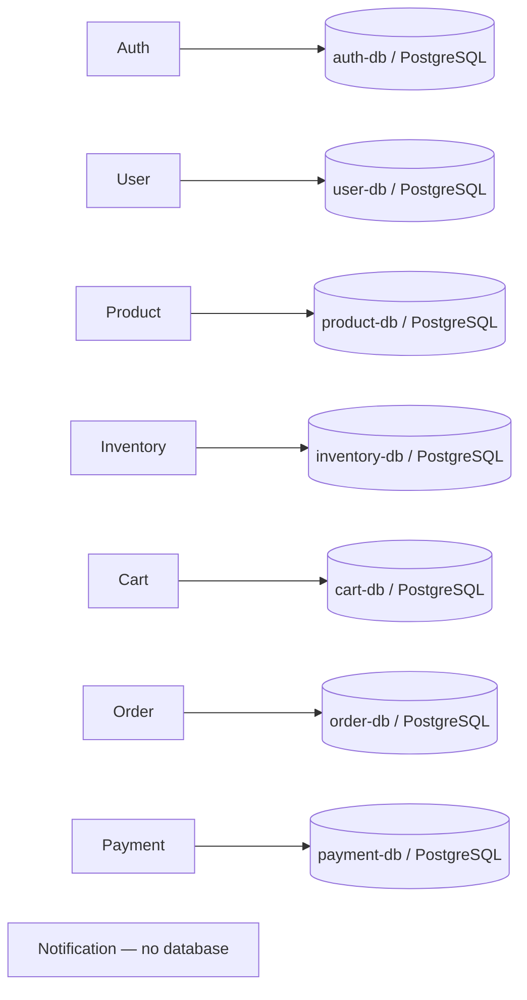

# Detailed architecture

This document defines architectural boundaries and proposed communication contracts only. Event names are design labels, not implemented APIs or message schemas.

## Internal service architecture

| Directory | Intended responsibility |
| --- | --- |
| `app/Domain/` | Business concepts, invariants, and domain policies independent of delivery and persistence technologies |
| `app/Application/` | Use-case coordination and ports required by the domain workflows |
| `app/Infrastructure/` | Future adapters for persistence, Redis, RabbitMQ, external providers, and remote service clients |
| `app/Interfaces/` | Future inbound HTTP and message delivery adapters |
| `routes/` | Future transport routing declarations |
| `config/` | Future service configuration |
| `database/` | Reserved service-owned persistence artifacts; no schemas or migrations included |
| `tests/` | Reserved unit, integration, and contract verification |
| `Dockerfile` | Empty container-build placeholder |
| `.env.example` | Empty service environment placeholder |

Dependencies point inward: Interfaces → Application → Domain. Infrastructure supplies adapters for ports defined by the inner layers. Domain has no dependency on frameworks, databases, transport, or sibling services. Services do not import each other's application code.

## REST communication

All frontend API traffic follows Frontend → Nginx → API Gateway → destination service. The gateway routes to Auth, User, Product, Inventory, Cart, Order, and Payment; it does not coordinate checkout. Notification consumes events privately.

Internal REST calls use private Docker networking and service authentication. They do not loop through public Nginx or the public gateway. Arrows below show the caller and destination; responses return on the same request.

| Caller | Destination | Purpose and boundary |
| --- | --- | --- |
| API Gateway | Auth | Obtain/cache public verification keys; token checks normally occur locally |
| Cart | Product | Resolve products and provisional prices |
| Cart | Inventory | Show advisory availability; this does not reserve stock |
| Order | Cart | Obtain cart contents for checkout |
| Order | Product | Revalidate product eligibility and prices before recording an order |
| Order | User | Capture address and contact information for the order snapshot |
| Order | Inventory | Request an authoritative stock reservation and later commit/release it |
| Order | Payment | Start an idempotent payment attempt, reconcile status, or request a refund |
| Notification | User | Resolve recipient preferences when processing delivery events |

No other internal REST dependencies are proposed. Auth issues identity identifiers; User stores the corresponding profile without reading Auth's database. Business services also validate identity and resource ownership at their own boundaries. Provider callbacks require provider-specific verification at Payment.

## RabbitMQ communication

Publishers emit business facts to RabbitMQ. Each consuming service has its own durable queue so one consumer cannot remove another service's copy. Dashed arrows identify asynchronous delivery.

| Producer | Event | Consumers | Purpose |
| --- | --- | --- | --- |
| Auth | `IdentityRegistered` | User | Provision the profile associated with the identity |
| Product | `ProductChanged` | Cart | Invalidate cached product details and provisional prices |
| Inventory | `ReservationExpired` | Order | Reconcile checkout and cancel or compensate as required |
| Payment | `PaymentSucceeded` | Order | Advance the order after verifying reservation commitment |
| Payment | `PaymentFailed` | Order | Cancel checkout and release its reservation |
| Payment | `RefundCompleted` | Order, Notification | Record refund completion and notify the customer |
| Order | `OrderConfirmed` | Cart, Notification | Remove only purchased cart quantities from the checkout snapshot and send confirmation |
| Order | `OrderCancelled` | Notification | Send a cancellation notice |

Order is the checkout coordinator. It records a pending order snapshot, obtains a stock reservation, and starts payment through REST. Payment outcomes arrive asynchronously. Order commits the reservation before confirmation; failure or expiry triggers release and, if money was captured, a refund request. This is a compensating workflow, not a distributed database transaction.

Reliable delivery is an architectural requirement: data-owning publishers need durable publication coordinated with local state, and consumers need idempotent processing, bounded retries, dead-letter handling, and reconciliation for missing or late outcomes. No outbox, schema, retry configuration, or workflow code is included here.

Notification intentionally has no PostgreSQL database in the requested initial topology. Its durable queue preserves pending delivery work; delivery should use stable event-based provider idempotency keys where supported. Without durable delivery history or provider deduplication, retries may produce duplicate messages. If delivery auditing or stronger deduplication becomes a requirement, Notification should gain its own store rather than borrow another service's database.

## Database ownership

Each arrow is exclusive ownership, including all writes and reads. Logical databases may share a PostgreSQL server for local development, with separate credentials and grants. Production databases can move to separate instances without changing ownership boundaries. PostgreSQL remains authoritative for inventory, carts, identity sessions, orders, and payments.

## Redis usage

| Redis client | Intended use | Authoritative source |
| --- | --- | --- |
| API Gateway | Shared rate-limit counters | Transient policy state |
| Auth | Short-lived login throttling and authentication challenge state | Identity and refresh-session records remain in `auth-db` |
| Product | Read-through catalog cache | `product-db` |
| Inventory | Cached availability for browsing only | `inventory-db`; reservation decisions use authoritative storage |
| Cart | Cached active carts | `cart-db` |

User, Order, Payment, and Notification have no Redis dependency in this initial design. Each Redis client owns a namespace and has scoped access. TTLs and invalidation bound cache staleness; evicting a cache must not erase durable business state. Redis does not arbitrate stock reservations or replace RabbitMQ. Security-related transient-state outages require an explicit restrictive policy rather than silently bypassing checks.

## Docker infrastructure and network position

| Boundary | Planned containers and connections |
| --- | --- |
| Public ingress | Nginx exposes HTTPS; routes frontend delivery to the frontend container and API requests to the gateway |
| Edge network | Nginx, Frontend, API Gateway; the gateway bridges to the private application network |
| Application network | Gateway and eight independently deployable service containers; only documented REST relationships are allowed |
| Data networks | Service-owned PostgreSQL access, Redis access for listed clients, RabbitMQ access for listed producers/consumers |
| Durable storage | PostgreSQL volumes and RabbitMQ message volumes, with independent backup and recovery planning |
| External integrations | Payment provider and notification delivery providers reached by the owning service |

Containers and a shared private network alone do not enforce per-service authorization. Scoped credentials and appropriate network policy enforce the documented boundaries. Databases, Redis, RabbitMQ, and microservices have no direct public ingress. Only Nginx publishes the public application entry point.

`infrastructure/nginx/`, `redis/`, and `rabbitmq/` reserve future platform configuration locations. `infrastructure/docker/` reserves network, volume, and deployment definitions. The root Compose file and per-service Dockerfiles are empty placeholders, so no container stack or network policy is implemented.

## Scalability boundaries

Frontend, gateway, and HTTP service replicas should keep durable business state outside their processes. RabbitMQ consumer concurrency can scale separately from HTTP traffic. Database connections, provider limits, and queue backlogs bound scaling. Correlation identifiers should propagate across HTTP and events, with logs, metrics, and tracing spanning the checkout workflow. These are design requirements only; no observability stack or deployment implementation is generated.
